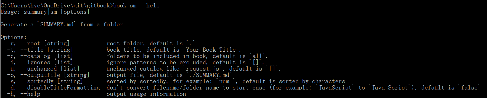

# gitbook(hycPEXM) for notes
gitbook for Github Pages(https://hycpexm.github.io/gitbook/)



`gitbook init`

`gitbook install`

`book sm`: would replace 'space' with %20... 若文件名中带有空格，在SUMMARY.md里会把第一个出现的d空格转换成%20，此外若文件名含'-'这种特殊字符，在SUMMARY.md里无法正确地生成它，所以还需手动修改SUMMARY.md，以保证整个目录结构的正确；还有就是用完这个命令就不要再运行`gitbook init`了，否则生成错误的文件还得一个个删

`gitbook serve`

## issue

### chapter numbering

```json
"theme-default": {
             "showLevel": true
        }
	}
```

为什么每一章的起始编号都是1？

### gitbook install [mathjax/mathjax-pro]

报错：

```
info: install plugin "mathjax-pro" (*) from NPM with version 0.0.6
fetchMetadata -> 304      / |#############################################-----------------------------------------------------------------------------------------------------------------|
C:\Users\hyc\.gitbook\versions\3.2.3\node_modules\npm\node_modules\aproba\index.js:25
    if (args[ii] == null) throw missingRequiredArg(ii)
                          ^

Error: Missing required argument #1
    at andLogAndFinish (C:\Users\hyc\.gitbook\versions\3.2.3\node_modules\npm\lib\fetch-package-metadata.js:31:3)
    at fetchPackageMetadata (C:\Users\hyc\.gitbook\versions\3.2.3\node_modules\npm\lib\fetch-package-metadata.js:51:22)
    at resolveWithNewModule (C:\Users\hyc\.gitbook\versions\3.2.3\node_modules\npm\lib\install\deps.js:490:12)
    at C:\Users\hyc\.gitbook\versions\3.2.3\node_modules\npm\lib\install\deps.js:491:7
    at C:\Users\hyc\.gitbook\versions\3.2.3\node_modules\npm\node_modules\iferr\index.js:13:50
    at C:\Users\hyc\.gitbook\versions\3.2.3\node_modules\npm\lib\fetch-package-metadata.js:37:12
    at addRequestedAndFinish (C:\Users\hyc\.gitbook\versions\3.2.3\node_modules\npm\lib\fetch-package-metadata.js:67:5)
    at returnAndAddMetadata (C:\Users\hyc\.gitbook\versions\3.2.3\node_modules\npm\lib\fetch-package-metadata.js:121:7)
    at pickVersionFromRegistryDocument (C:\Users\hyc\.gitbook\versions\3.2.3\node_modules\npm\lib\fetch-package-metadata.js:138:20)
    at C:\Users\hyc\.gitbook\versions\3.2.3\node_modules\npm\node_modules\iferr\index.js:13:50 {
  code: 'EMISSINGARG'
}
```

