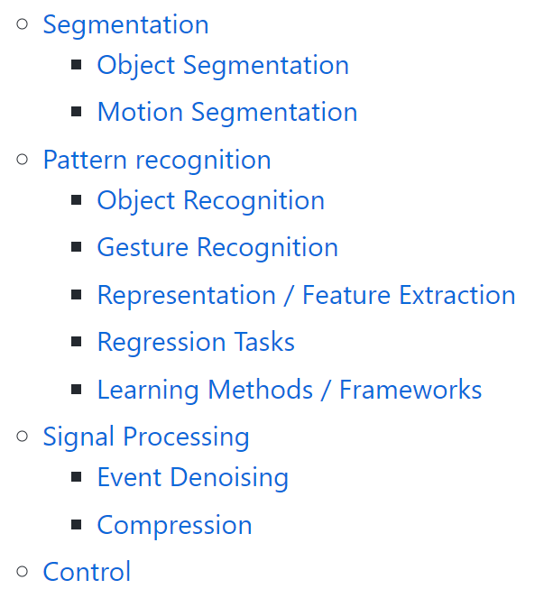
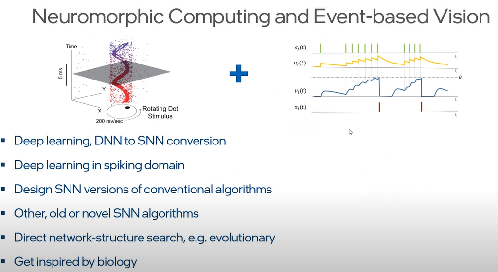
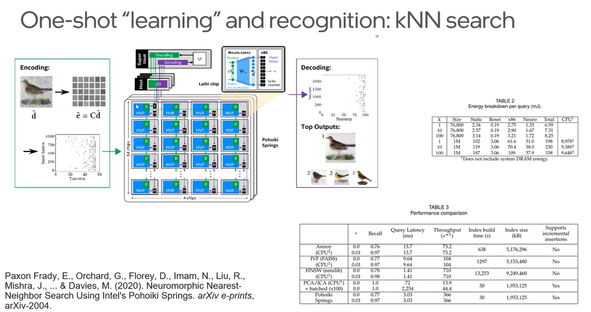
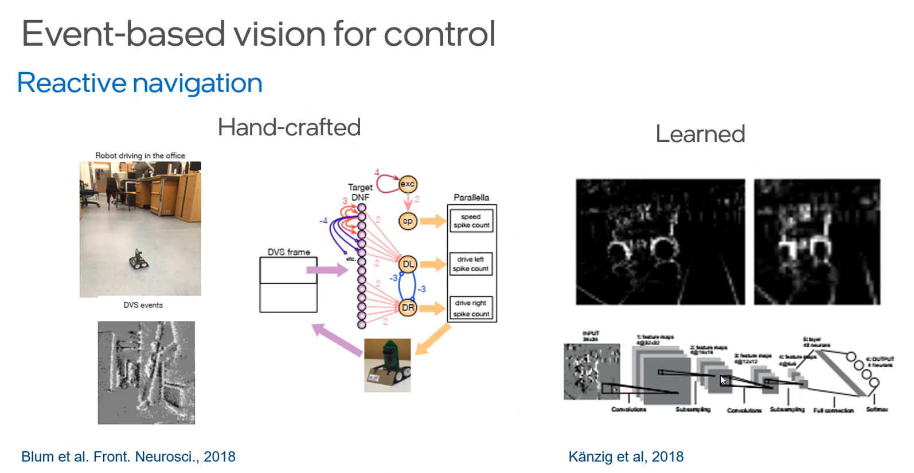
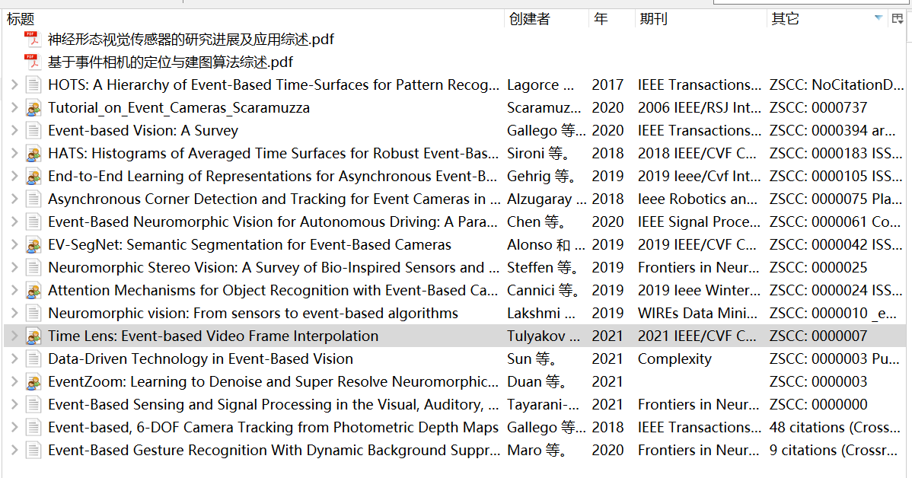
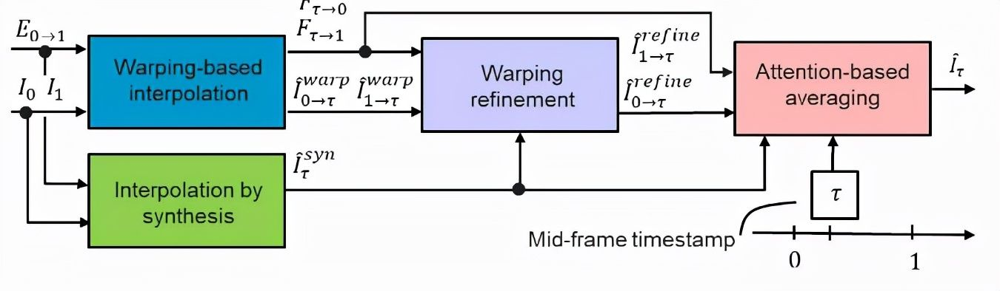

## 前两周工作目标

- linux系统编程学到120/187：无血缘关系进程间mmap通信
- 学完二叉搜索树（邓俊辉）
- 操作系统网课研究绪论部分的实验项目：控制系统启动，添加系统调用（李治军）

- 继续阅读生物物理相关文献；入门pytorch（毕业论文）

- 开始研究地平线开发板

- 把上次还没学完的git入门教程学完

- 抽空复习模电、数电

## 本两周工作内容

- 学完git教程剩余部分
  - 分支管理
  - 多人协作
  - Git tag & Github releases
  - Git Flow工作流程
- linux系统编程学至124/187，主要内容是进程间通信中的：
  - 管道，命名管道fifo，pipe函数
  - 通过文件实现进程间通信
  - 存储映射 I/O与mmap函数
- 阅读事件相机、SLAM相关资料，记录如下：

---

通篇略读了这篇slam综述，还是有不少没有理解的地方：

Cadena, Cesar, Luca Carlone, Henry Carrillo, Yasir Latif, Davide Scaramuzza, José Neira, Ian Reid, and John J. Leonard. “Past, Present, and Future of Simultaneous Localization and Mapping: Toward the Robust-Perception Age.” *IEEE Transactions on Robotics* 32, no. 6 (December 2016): 1309–32. https://doi.org/10.1109/TRO.2016.2624754.

----

常见事件相机分类

- Dynamic Vision Sensor(DVS) 仅输出事件流信息
- Asynchronous Time Based Image Sensor(ATIS) 输出事件流与灰度信息
- Dynamic and Active Pixel Vision Sensor(DAVIS) 输出事件流与灰度信息

高频名词

- GEF
- E2VID
- U-net
- Attention机制
- Event-based SR （Super Resolve超分辨；超分辨率重建）
- warping; warp
- event to image; event to intensity (image)；E2I由E2VID和FSRCNN组成
- 基于GAN、LSTM、CNN、SNN、RNN的方法

----

[Event Cameras, Event camera SLAM, Event-based Vision, Event-based Camera, Event SLAM (uzh.ch)](https://rpg.ifi.uzh.ch/research_dvs.html)这个苏黎世大学的网站整理了近几年事件相机相关的工作进展

事件相机实现轻量化人脸识别的方法应该是由类似于SqueezeNet、MobileNet、ShuffleNet(V2)、Xception这样的轻量化CNN来实现的（有待后续调研验证），这属于模式识别的范畴，它包含于一个更广的范畴：事件信号触发与后续处理相结合的技术（这也应该是我关注的重点，刚开始走弯路没搞清要带着什么目的去看资料），这应该能在[uzh-rpg/event-based_vision_resources (github.com)](https://github.com/uzh-rpg/event-based_vision_resources)网站中的[Feature Detection and Tracking](https://github.com/uzh-rpg/event-based_vision_resources#feature-detection)、[Pattern recognition](https://github.com/uzh-rpg/event-based_vision_resources#pattern-recognition)、[Signal Processing](https://github.com/uzh-rpg/event-based_vision_resources#signal_processing)、[Segmentation](https://github.com/uzh-rpg/event-based_vision_resources#segmentation)、[Object Pose Estimation](https://github.com/uzh-rpg/event-based_vision_resources#object_pose_estimation)、[SLAM (Simultaneous Localization And Mapping)](https://github.com/uzh-rpg/event-based_vision_resources#slam)等分类（如下图所示）中找到相关文献，应该注意recognition，event-driven，processing这样的关键字。

---

[CVPR 2021 Workshop on Event-based Vision (tub-rip.github.io)](https://tub-rip.github.io/eventvision2021/)   这个网站整理了2021CVPR国际事件相机会议的内容，收集了会议的视频和slides，以下内容我认为值得关注一下（还没看）：

- Event-driven convolution based processing
- [Back to Event Basics: Self-Supervised Learning of Image Reconstruction for Event Cameras via Photometric Constancy - MAVLab (tudelft.nl)](https://mavlab.tudelft.nl/ssl_e2v/)
- Event-based vision and processing for tiny drones.

我看了这个讲座：[Yulia Sandamirskaya. Neuromorphic computing hardware and event based vision: a perfect match? - YouTube](https://www.youtube.com/watch?v=0Zevb04mw3M)，主要讲了将硬件（类似Intel Loihi，IBM TrueNorth这样的神经形态计算芯片和事件相机)与软件(主要是人工智能方法)相结合的研究、应用和前景

基于SNN识别事件序列：人的动作

Stewart, K., Orchard, G., Shrestha, S. B., & Neftci, E. (2020). Online few-shot gesture learning on a neuromorphic processor. IEEE Journal on Emerging and Selected Topics in Circuits and Systems, 10(4), 512-521.

---

索尼的事件相机

[Sony Group Portal - AI Initiatives - Event-based vision sensor (EVS)](https://www.sony.com/en/SonyInfo/sony_ai/technology/evs.html)

[Sony to Release Two Types of Stacked Event-Based Vision Sensors with the Industry’s Smallest 4.86μm Pixel Size for Detecting Subject Changes Only Delivering High-Speed, High-Precision Data Acquisition to Improve Industrial Equipment Productivity｜News Releases｜Sony Semiconductor Solutions Group (sony-semicon.co.jp)](https://www.sony-semicon.co.jp/e/news/2021/2021090901.html)

[Technology：EVS｜Image Sensor：Industry｜Products｜Sony Semiconductor Solutions Group (sony-semicon.co.jp)](https://www.sony-semicon.co.jp/e/products/IS/industry/technology/evs.html)  简要介绍了EVS的工作机制

----

[事件相机调研(Event-based Vision: A Survey[3]) - 知乎 (zhihu.com)](https://zhuanlan.zhihu.com/p/80682334)

----

这两篇文章可以借鉴一下

[CVPR2020事件相机（Event Camera）研究文章汇总 - 知乎 (zhihu.com)](https://zhuanlan.zhihu.com/p/161419844)

[2021事件相机(Event-based)各大顶会论文个人整理 - 知乎 (zhihu.com)](https://zhuanlan.zhihu.com/p/427762508)，这篇整理的文献大都采用了神经网络的方法

Z. W. Wang, P. Duan, O. Cossairt, A. Katsaggelos, T. Huang and B. Shi, "Joint Filtering of Intensity Images and Neuromorphic Events for High-Resolution Noise-Robust Imaging," 2020 IEEE/CVF Conference on Computer Vision and Pattern Recognition (CVPR), 2020, pp. 1606-1616, doi: 10.1109/CVPR42600.2020.00168. 文章提出了一个全新的优化框架，**guided event filtering (GEF)**。这个框架结合了普通相机和事件相机的数据，估计运动参数与导向滤波、超分辨率等任务，同时这个框架后续可以用于特征跟踪等任务。其基本思想是事件相机积累图的边缘，和传统图像的梯度，理论上是相同的。文中同样采用RPG提出的最大化对比度的方式进行运动参数估计，只是修正了目标函数，加入了灰度图像的梯度，减小了事件噪声的影响。

----

以下是我目前筛选出来的文章，大部分只看了摘要

----

[「事件相机」告别模糊！CVPR 2021发表视频慢动作的新sota，还发了160FPS的数据集 - 知乎 (zhihu.com)](https://zhuanlan.zhihu.com/p/410497861)

https://rpg.ifi.uzh.ch/docs/CVPR21_Gehrig.pdf

[TimeLens: Event-based Video Frame Interpolation (CVPR 2021) - YouTube](https://www.youtube.com/watch?v=dVLyia-ezvo)                

[slides.pdf (uzh.ch)](https://rpg.ifi.uzh.ch/timelens/slides.pdf)

S. Tulyakov*, D. Gehrig*, S. Georgoulis, J. Erbach, M. Gehrig, Y. Li, D. Scaramuzza

Time Lens: Event-based Video Frame Interpolation

IEEE Conference on Computer Vision and Pattern Recognition, 2021.

基于事件的帧插值方法(event-based frame interpolation)通常采用基于综合(synthesis-based)的方法，其中预测的帧残差直接应用于关键帧(key-frames)。然而，虽然这些方法可以捕捉非线性运动，但它们会受到重影的影响，在低纹理、事件较少的区域表现不佳。因此，基于综合和基于流程的方法是互补的。论文提出的Time Lens方法能够有效利用二者的优势。论文在三个合成基准和两个实际基准上对我们的方法进行了广泛的评估，结果显示，与最先进的基于帧和基于事件的方法相比，PSNR提高了5.21 dB。

Time Lens是一个基于学习的框架，由四个专用模块组成，这些模块互相之间可以进行补充插值，能够同时进行基于warping和合成的插值。

1. 基于warping的插值模块（Interpolation by synthesis），通过使用从各个事件序列估计的光流warping边界RGB关键帧来估计新帧
2. warping refinement模块通过计算剩余光流来改进这种帧估计
3. 合成插值模块通过直接融合来自边界关键帧和事件序列的输入信息来估计新帧
4. 基于注意力的平均模块结合了基于warping和基于合成的插值结果

Time Lens的框架能够使生成的插入帧成为具有颜色和高纹理细节的新帧，同时能够处理非线性运动、光线变化和运动模糊。在整个工作流中，所有的模块都使用相同的骨架结构沙漏网络（hourglass network），沙漏网络能够在收缩和扩张部分之间进行跳跃连接（skip connections）。

---

[论文分享-基于DVS相机的去噪和超分的神经形态事件研究 - 知乎 (zhihu.com)](https://zhuanlan.zhihu.com/p/398534959)

Duan, Peiqi & Wang, Zihao & Zhou, Xinyu & Ma, Yi & Shi, Boxin. (2021). EventZoom: Learning to Denoise and Super Resolve Neuromorphic Events. 10.1109/CVPR46437.2021.01263. 

论文提出了EventZoom，一个具有3D U-Net骨架结构的深度神经框架。EventZoom以一种噪声对噪声的方式进行训练，其中网络的两端是未经过滤的噪声事件，强制执行无噪声事件恢复。为了提高分辨率，EventZoom合并了一个由高分辨率图像监督的事件到图像模块。

EventZoom可以提高应用程序的性能，包括基于事件的视觉对象跟踪和图像重建：

- 物体追踪，利用E-MS追踪方法，利用了Mean Shift 聚类 和卡尔曼滤波的方法进行物体进行分类进而追踪。
- 论文通过可视化和量化结果两部分对于超分部分进行了简要分析，与SOTA的图像重建算法E2SRI方法相比，图像重建后质量通过PSNR、SSIM、MSE指标进行评价，发现在质量更好，误差更小的前提下，运行时间是原算法的1/10。

论文实现了去噪与超分的联合过程，并且实现了事件到图像的转换模块，主要解决了两类问题，一是去噪过程中的错误检测问题，二是超分过程中的模型的性能与复杂度的权衡。

论文中的客观的性能评价指标在于低延时，在去噪模块上，处理速度是同类的事件相机的40倍，而在超分重建过程中，处理速度是同类SOTA算法的10倍；采用的神经网络包括3D U-Net 、E2VID、FSRCNN，分别用于端到端的事件降噪器[E2E]、Event2Image的转换模块[E2I]、超分辨率模块[E2SRI]；数据集采用了高帧率视频数据集NFS、DVSNOISE20 、RGB-DAVIS分别用于超分、去噪超分联合、事件相机与帧相机联合的模型训练。最终将训练的网络应用于高级机器视觉任务中的对象追踪和图像重建。

文献的局限性表现在分辨率低，固件设施不够完善，因此限制了FPS与HDR。

## 思考与疑问

没规划好时间，完成的工作与目标差得有点多。

应该改进一下看文献的方法，提高阅读效率。阅读文献时对于看不懂的数学、算法和不了解的专业术语、方法不必太过于纠结，否则会看得很慢，即便细看了没理解也不会有什么印象。此外，为了调研，大部分文献先看重点关注的主要内容就好，不然每篇文献都钻进去研读通读会花很多时间。

目前还没有抓住对近年来事件相机的主流技术和事件信号触发结合后续处理的调研这条主线，文献、资料太多，有点无从下手的感觉。为了找突破口，我先查阅了网上的资料，不过比较零散，看了以后大概知道论文做了什么工作，但是无法把握哪些才算是主流技术。

后面我打算先从综述类文献先读起，先看Event-based Vision: A Survey和两篇中文综述：神经形态视觉传感器的研究进展及应用综述；基于事件相机的定位与建图算法：综述。此外，重点关注[uzh-rpg/event-based_vision_resources (github.com)](https://github.com/uzh-rpg/event-based_vision_resources#reviewpapers-algs)中的Review Papers、Pattern Recognition、Signal Processing分类中的文献，以及[CVPR2020事件相机（Event Camera）研究文章汇总 - 知乎 (zhihu.com)](https://zhuanlan.zhihu.com/p/161419844)和[2021事件相机(Event-based)各大顶会论文个人整理 - 知乎 (zhihu.com)](https://zhuanlan.zhihu.com/p/427762508)这两篇推文中列举的文献。

不知道老师对此有什么建议或者有什么资料推荐一下。

## 后两周工作目标

- 阅读生物物理RNA结构预测相关文献，写开题报告；入门pytorch
- 继续学习linux系统编程
- 学完二叉搜索树（邓俊辉）
- 阅读、整理事件相机相关文献
- 操作系统网课研究绪论部分的实验项目：控制系统启动，添加系统调用（李治军）
- 研究地平线开发板
- 抽空复习模电、数电

